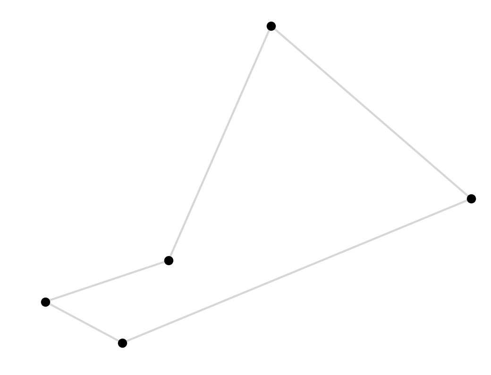
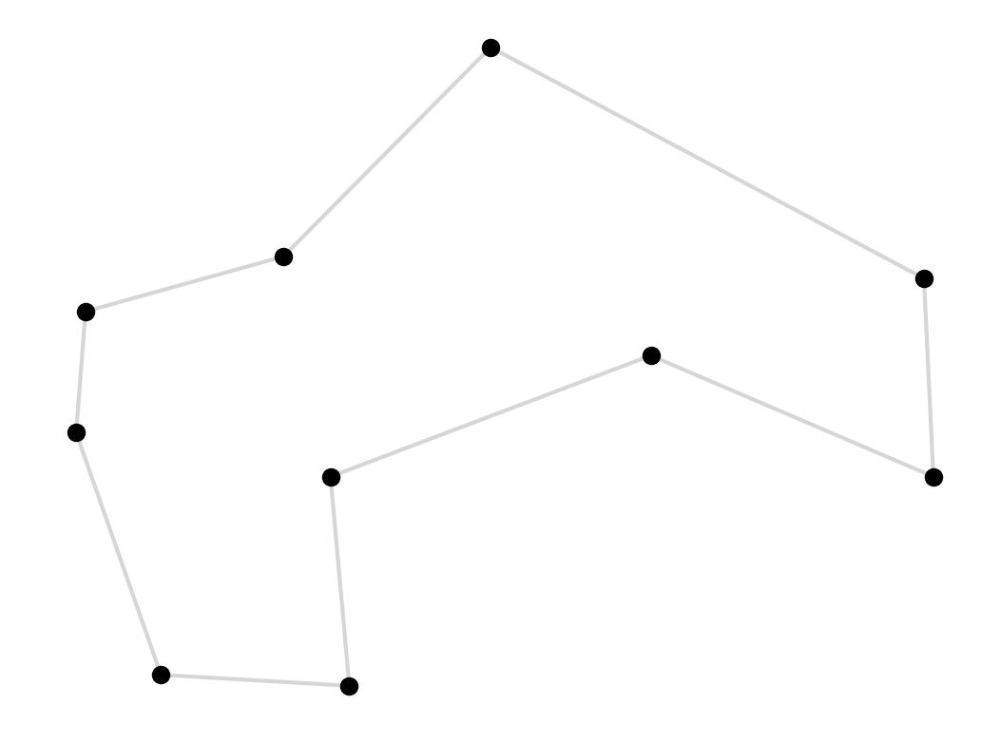
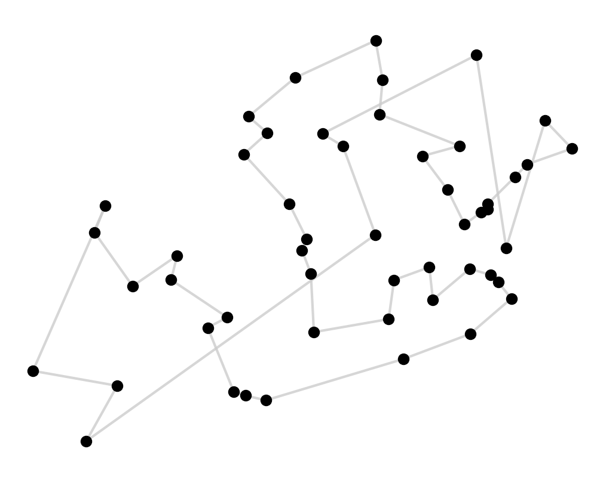
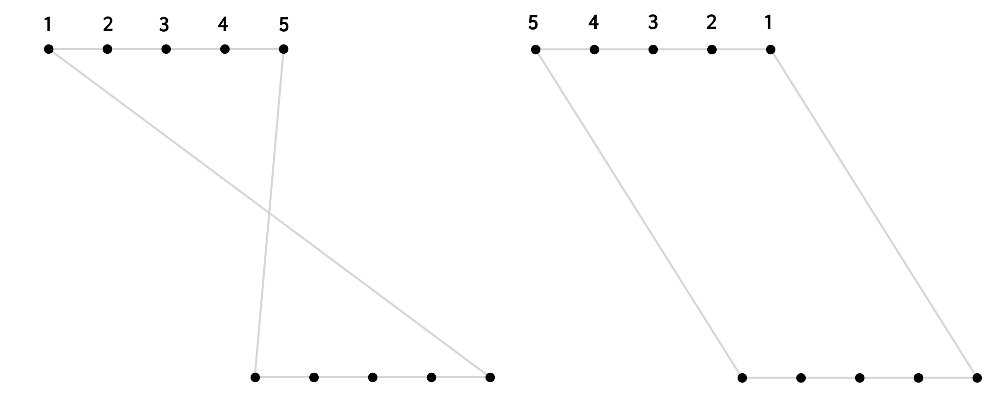
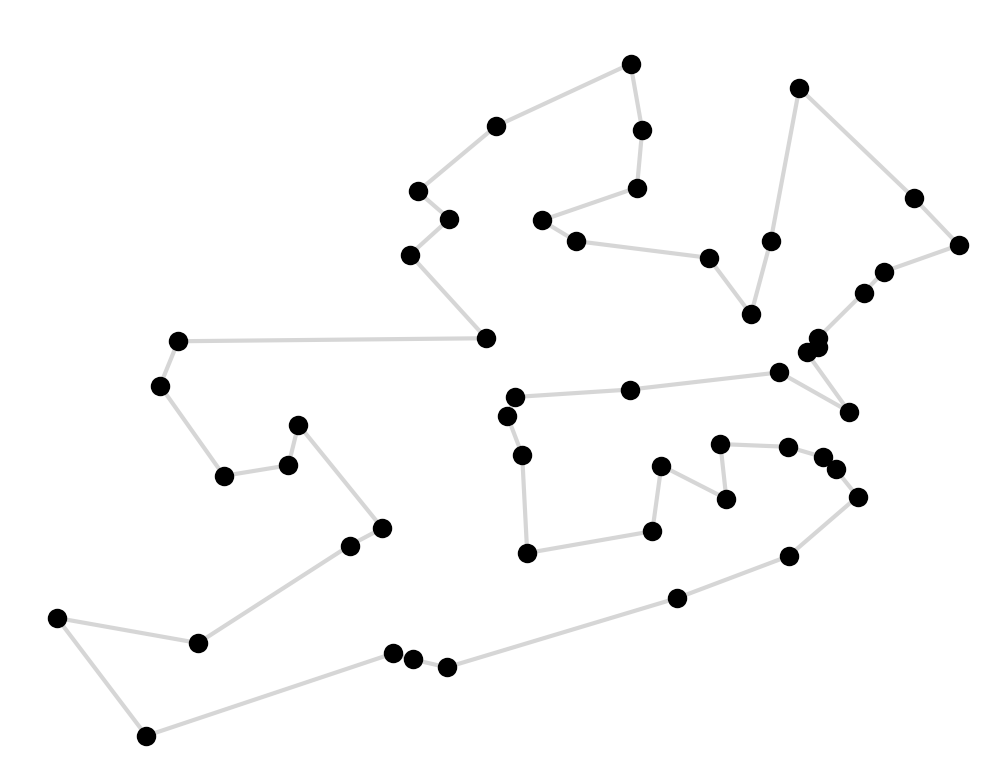

Summertime is coming so I've built the best road-trip of Ireland.

What would the best road-trip look like? You'd probably want to travel around the country seeing as many sights as possible, while keeping driving to a minimum.

The first thing to do is pick the places you want to see. Thankfully Wikipedia give us a useful [list of tourist attractions in Ireland](https://en.wikipedia.org/wiki/List_of_tourist_attractions_in_Ireland), which makes for a good guide. For my road-trip I decided to go with one stop off in every county, and a few other greatest hits as well, giving us 51 tourist attractions in total. To make this list I wrote a short script to pick places on the Wiki list and grab their latitudes and longitudes, giving

<table border="1" class="dataframe">  <thead>    <tr style="text-align: center;">      <th>Lat</th>      <th>Lon</th>      <th>Name</th>    </tr>  </thead>  <tbody>    <tr>      <td>54.597000</td>      <td>-5.930000</td>      <td>Belfast</td>    </tr>    <tr>      <td>55.240833</td>      <td>-6.511667</td>      <td>Giant's Causeway</td>    </tr>    <tr>      <td>54.347811</td>      <td>-6.656277</td>      <td>St Patrick's Cathedral</td>    </tr>    <tr>      <td>52.837337</td>      <td>-6.881004</td>      <td>Brownshill Dolmen</td>    </tr>    <tr>      <td>53.033333</td>      <td>-9.100000</td>      <td>The Burren</td>    </tr>  </tbody></table>

Now that we've got a list of places we want to work out the best route to visit them all. It seems to me that the best route would be the shortest loop that goes through all of the locations once and then takes you back home. Unfortunately this is an example of the classic Traveling Salesperson Problem (TSP), and it's known to be a hard, [NP-hard](https://en.wikipedia.org/wiki/NP-hardness) in fact. The issue is that there for a given number of locations, $N$, there are $N!$ possible routes through them. For our case of 51 locations there are

```python
reduce(mul, range(1, 52))
1551118753287382280224243016469303211063259720016986112000000000000
```
routes, which is around about the number of atoms in the Milky Way. So it's a lot. Too many to for us to check anyway, so let's start out a bit smaller.

Let's say we have 5 points we want to visit, how would we approach that problem? First step is to choose some abstractions that make our problem easier to define. I've found that the best way to work with 2D points in Python is to encode them as complex numbers, so I'll do that, and I'll use a list of complex numbers to denote a route

```python
Point = complex
class Route:
    def __init__(self, path):
      self.path = path
```

The nice thing about encoding the points a complex numbers is that we can compute the distance between two points easily, it's the absolute value of the vector difference between them, $|A-B|$. I'll add a method to the route object to compute this

```python
def length(self):
    return sum(abs(self.path[i-1] - self.path[i])
              for i in range(len(path)))
```

Now we have a way of encoding points and routes, and computing route lengths. Let's plot up 5 random points


Between these 5 points there are 120 possible routes, which isn't too many, we can check them all and pick the shortest

```python
def exhaustive(pts):
    return min((Route(i) for i in permutations(pts)), key=lambda x: x.length())
```

This gives us



Unfortunately we start to run into bother fairly quickly, as the number of possible routes gets too big to exhaustively check. By the time we get to 10 points ($10! = 3628800$) we're already getting to a point where my impatience is starting to become a factor. There is one speed up available to us here, we don't actually need to look at all $N!$  permutations since some are duplicates, the route $(1, 2, 3)$ is the same as the route $(3, 1, 2)$. We can weed these out by arbitrarily choosing a starting place and permuting everything else

```python
def nonredundant_permutations(pts):
        head, *tail = pts
        return [[head] + list(p) for p in permutations(tail)]
```

This saves us a factor of $N$, there are only $N-1!$ non-redundant permutations, so with this change we can find the best 10 point path in the time it would haven taken to do 9, for example:



This change doesn't solve our problem though, it's just a brief  reprieve.

One famous result that's useful here is the Held-Karp algorithm. This dynamic programming algorithm, devised back in the 60's, is based on the clever observation that only the shortest path between any two points can be part of the shortest overall loop. Using this idea we can again cut down the number of paths we need to search to a smaller, but still exponential, $N^22^N$. This is a really cool algorithm, but unfortunately for us $52^22^{52}$ is still too many paths to check so we're going to have to give up on finding the optimal path.

All's not lost though, there are a lot of ways of finding approximate solutions to the TSP, paths that may not be optimal but should be very good. One method is the [Kruskal's Minimum Spanning Tree](https://en.wikipedia.org/wiki/Kruskal%27s_algorithm) algorithm, which comes with the guarantee that the solution it finds will be no more than twice as long as the optimal solution. There are [branch and cut](https://ac.els-cdn.com/S0166218X0400071X/1-s2.0-S0166218X0400071X-main.pdf?_tid=8aa24f1c-275b-494f-aee0-001beabc8cde&acdnat=1528291224_c94177cc2cf73eef9724a96e8c017b73) algorithms that are extremely efficient and can find optimal tours for modest numbers of points -- up to 50 if you've got a bit of time on your hands. I've also had some success using genetic algorithms for solving problems like these, check out the [DEAP](https://github.com/DEAP/deap) library.

I'm not going to use any of these for this problem, I'm going to keep it simple and use a very straightforward (and fast) algorithm to get us a decent approximate solution. I'll begin with a greedy algorithm. This algorithm starts at a point and moves to the nearest point that hasn't been visited yet, and keeps doing that until it gets back to the start. We can implement this with a very succinct recursive algorithm

```python
def greedy(pts, route):
        if not pts:
                return route
        p = min(pts, key=lambda x: abs(route[-1] - x))
        i = pts.index(p)
        return greedy(pts[:i] + pts[i+1:], route + [p])
```

Applying this to our 52 Irish landmarks we get this



Not a great solution. It does a good job of finding nearby places but towards the end of the tour you paint yourself into a corner and all that we're left with is a lot of long jumps to get to the remaining points.

We're not stuck here though, we can go about fixing these long hops and shortening this tour. The way to untie these knots is to notice that if we have a crossed line we can uncross it, and shorten the tour, by flipping one of the subsegments at the end of the cross,



Again we can write a small recursive function to do these swaps until it can find any more that shorten the tours
```python
def try_swaps(route_in):
    post_swap = swap_points(route_in)
    if post_swap == route_in:
        return post_swap
    else:
        return try_swaps(post_swap)
```

To do this we need to add an ```__eq__``` to the Route class, which is simply tests if two lists are rotations of one another. We also need a the ```swap_points``` function. This is very simple, it just iterates through every subsegment of length $>1$ and flips it, if this flip reduces the length of the tour then keep it, if not then don't.

```python
def swap_points(r):
    min_l = r.length()
    for s in swaps:
        p = r.path[:]
        i, j = s[0], s[1] % len(p)
        if Route(p[:i] + p[i:j][::-1] + p[j:]).length() < min_l:
            r = Route(p)
            min_l = r.length()
    return r
```
Applying this we turn our greedy tour into this



Cool, this is a much better route! We've removed all of the crosses and we can even see the outline of Ireland here.

One obvious issue with our road trip remains, and that's the road part. The path we've computed here is the shortest distance between pairs of points crow flies, crossing rivers, lakes, and seas. We want to find an actual *road* trip.

To compute a real road trip we can turn to Google Maps. We can us the Maps API to compute the best driving route between each pair of points, and how long that route takes to travel. 1,300 calls to the API later we have build our $N\times N$ time matrix, which stores the travel time between each pair of points.

It just takes a few small changes to our code to compute the minimum time TSP. All we have to do is add a ```.time()``` method to our route class that returns the sum of travels times over the route, and use that everywhere we previously used ```.length()```. Putting this into our greedy solver, and applying the same uncrossing trick we get our best guess at the optimal road trip. We can use the even use the Maps API to visualise it:

<figure class="full-width">
<center>
    <embed src="../images/road/road-tripping.html" width="1400px" height="900px" alt="">
</center>
</figure>

You can see the fullscreen map [here](http://n-o-r.xyz/road-tripping.html).
